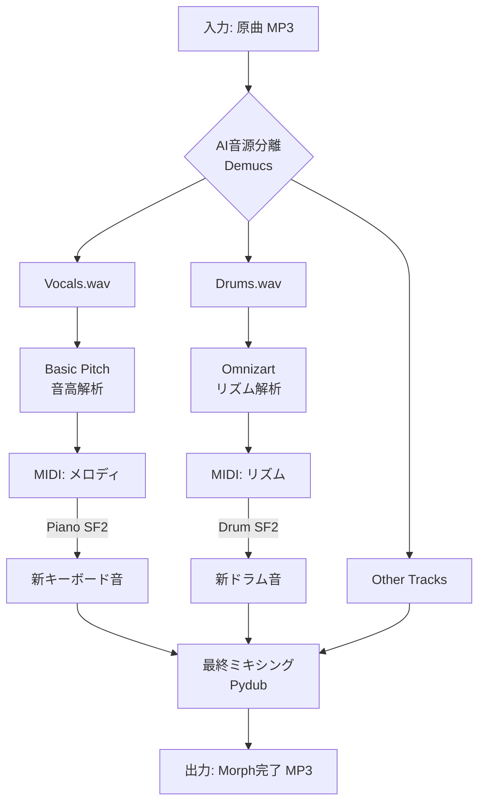

# 🎹 MidiMorph: AI Music Transformer (v0.1)

**MidiMorph** は、既存の音源（MP3等）をAIで楽器ごとに解体し、特定のパート（ボーカルやドラム）を別の音色に「モーフィング（差し替え）」して再構築するMac用コマンドラインツールです。

---

## 🚀 プロジェクトの概要

「原曲のニュアンスを保ったまま、音色だけを自由に入れ替える」ことを目的としています。

- **ボーカル** → 高品質なピアノやシンセのメロディへ変換。
- **ドラム** → 最新のリズムマシンや生ドラムセットへ変換。
- **伴奏** → 元の音源を活かしつつ、新しい楽器とミックス。

---

## 🛠 技術スタック

| カテゴリ | ツール / ライブラリ | 用途 |
| --- | --- | --- |
| **環境** | Python 3.10+ (macOS) | メインロジック |
| **音源分離** | [Meta Demucs](https://www.notion.so/2026-1-29-2f75d613b18e80a4bc26e76b4124ba70?pvs=21) | ボーカル・ドラム・ベースの抽出 |
| **メロディ解析** | [Spotify Basic Pitch](https://www.notion.so/2026-1-29-2f75d613b18e80a4bc26e76b4124ba70?pvs=21) | オーディオからMIDIへの変換 |
| **リズム解析** | Omnizart / Magenta | ドラムの打点解析 |
| **音声合成** | FluidSynth (SoundFont) | MIDIを新しい楽器音でレンダリング |
| **音声編集** | Pydub / FFmpeg | 最終ミキシングとエフェクト処理 |

---

## 📊 システムアーキテクチャ

コード スニペット



---

## 📦 セットアップ（Mac環境）

### 1. システム依存ツールのインストール

```bash
# HomebrewでPythonと音声処理ツールをインストール
brew install python ffmpeg fluidsynth
```

### 2. プロジェクト環境の作成

```bash
mkdir MidiMorph && cd MidiMorph
python3 -m venv venv
source venv/bin/activate
```

### 3. ライブラリのインストール

```bash
pip install demucs basic-pitch pydub
```

---

## 📂 ディレクトリ構造案

```
MidiMorph/
├── main.py              # メイン実行ファイル
├── assets/
│   └── soundfonts/      # 楽器音源 (.sf2)
├── inputs/              # 変換前の音源
├── outputs/             # 変換後の音源
└── workspace/           # AI処理の一時保存先`
```

---

## 📝 実行コード（プロトタイプ）

`main.py` の最小構成案です。

```python
import os
import subprocess
from pydub import AudioSegment

def run_midimorph(input_file):
    print("--- Phase 1: Stem Separation (Demucs) ---")
    # 実際はここで subprocess.run(["demucs", "-n", "htdemucs", input_file]) 等を実行

    print("--- Phase 2: Audio to MIDI (Basic Pitch) ---")
    # ボーカルトラックを解析

    print("--- Phase 3: Synthesizing New Sound ---")
    # MIDIを新しい音色で鳴らす

    print("--- Phase 4: Final Mix ---")
    # 全てのトラックを重ねる

    print("✅ Morphing Complete!")

if __name__ == "__main__":
    # 実行時の引数処理などを記述
    pass`
```
